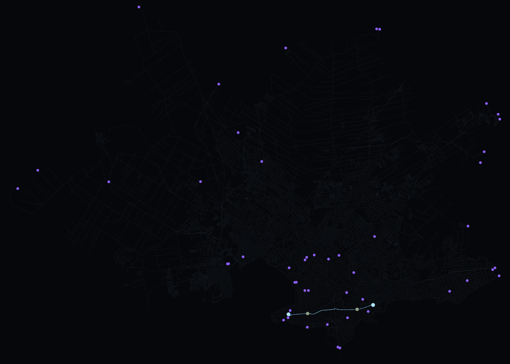
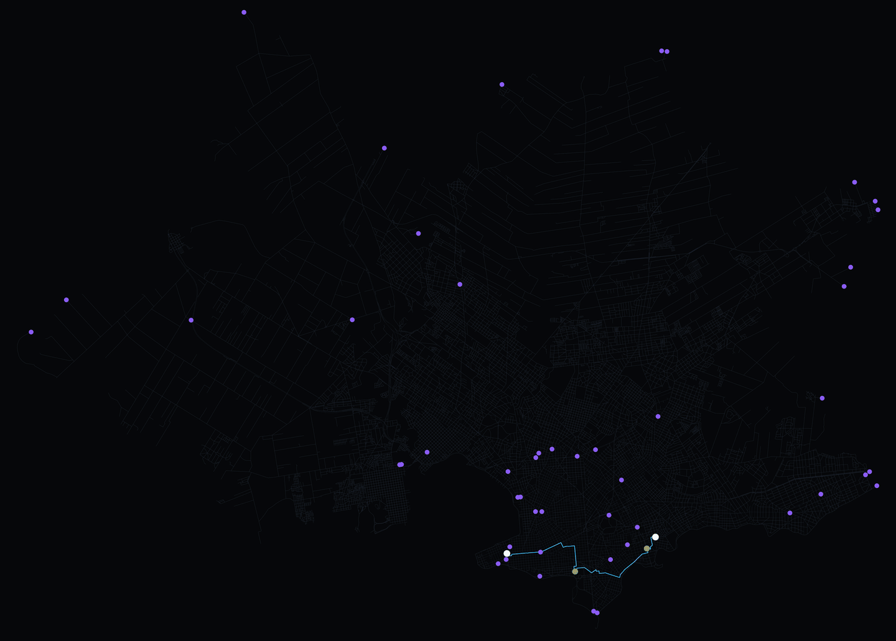

# Proyecto Universitario - Routing para Vehiculos Electricos

Este proyecto implementa y compara algoritmos de busqueda de caminos (A* y Greedy) adaptados para vehiculos electricos (EV) en la ciudad de Montevideo, Uruguay. El sistema considera restricciones de bateria, consumo energetico y la necesidad de recargas en estaciones estrategicamente ubicadas.

---

## Descripcion del Proyecto

El objetivo principal es encontrar rutas optimas para vehiculos electricos, teniendo en cuenta:

- Consumo de energia basado en la distancia y un coeficiente de consumo.
- Capacidad limitada de la bateria.
- Ubicacion de estaciones de carga.
- Compromiso entre la distancia recorrida, el numero de recargas necesarias y el tiempo de computo.

El sistema modela el estado del vehiculo no solo por su ubicacion (nodo en el grafo), sino tambien por su nivel de bateria restante. Es decir, el estado se representa como:

> **(nodo, nivel_de_bateria)**

Esto permite al algoritmo decidir cuando es necesario desviarse para recargar y visitar el mismo nodo con distintos niveles de bateria.

---

## Visualizacion de rutas

El proyecto incluye herramientas de visualizacion que permiten renderizar las rutas sobre el mapa real de Montevideo, utilizando el grafo obtenido de OpenStreetMap y las estaciones de carga reales.

| A* (Euclidiana) | Greedy (Euclidiana) |
| ---------------- | ------------------- |
|  |  |


---

## Algoritmos Implementados

1. **A\* (A Star) con Bateria**

   - Extiende el algoritmo A\* clasico al espacio de estados `(nodo, bateria)`.
   - `g(n)` representa la energia total consumida desde el origen hasta el estado actual.
   - `h(n)` es una heuristica admisible basada en la distancia (euclidiana / manhattan / octile) y el consumo minimo posible.
   - Considera transiciones especiales de recarga en nodos que son estaciones de carga.
   - Garantiza encontrar el camino de menor costo energetico si existe.

2. **Greedy (Voraz) con Bateria**

   - Usa el mismo espacio de estados `(nodo, bateria)`, pero ordena la busqueda solo por la heuristica `h(n)` (ignora `g(n)` para decidir que expandir).
   - Tiende a ir siempre “en linea recta” al destino segun la heuristica.
   - Es significativamente mas rapido en ejecucion, pero no garantiza la optimalidad de la ruta y suele consumir mas energia.

Ambos algoritmos utilizan:

- Discretizacion del nivel de bateria (por ejemplo, en pasos de 0.1 kWh) para mantener finito el espacio de estados.
- Cargadores mapeados a nodos reales del grafo vial de Montevideo.

---

## Caracteristicas Principales

- **Gestion de Bateria:** Discretizacion del nivel de bateria para manejar el espacio de estados de manera eficiente.
- **Sistema de Recarga:** Simulacion de recargas en nodos especificos (estaciones de carga), permitiendo al vehiculo recuperar energia para continuar su viaje.
- **Grafo Real:** Uso de datos de OpenStreetMap para la red vial de Montevideo y datos reales de estaciones de carga.
- **Benchmark:** Herramienta para ejecutar multiples casos de prueba y comparar el rendimiento de los algoritmos (tiempo, nodos expandidos, energia consumida, numero de recargas).
- **Visualizacion:** Generacion de mapas que muestran la ruta, estaciones de carga visitadas y el estado de la red.

---

## Instalacion

Este proyecto utiliza **`uv`** para la gestion de dependencias y entornos virtuales.

### Requisitos Previos

- Python instalado en el sistema.
- `uv` instalado.

Si no tienes `uv` instalado, puedes instalarlo con `pip`:

```bash
pip install uv
```

### Configuracion del Entorno

Para instalar las dependencias del proyecto, ejecuta:

```bash
uv sync
```
Esto creara el entorno y descargara todas las dependencias definidas para el proyecto.

### Ejecucion
El punto de entrada principal del sistema es main.py, que ofrece un menu interactivo para acceder a las diferentes funcionalidades.

Para ejecutar el programa:

```bash
uv run main.py
```

### Menu Principal
Al ejecutar el programa, veras opciones similares a las siguientes:

Ejecutar benchmark completo (A* vs Greedy):
Corre una serie de casos de prueba predefinidos y genera archivos JSON con los resultados y estadisticas comparativas (energia, nodos expandidos, tiempo, recargas).

Analizar resultados existentes:
Procesa los resultados generados por el benchmark para crear tablas resumen y graficos comparativos.

Test de visualizacion con colores de bateria:
Ejecuta una prueba rapida de visualizacion para verificar el funcionamiento del trazado de rutas y la representacion de la bateria a lo largo del camino.

Salir:
Cierra la aplicacion.

### Estructura del Proyecto

main.py: Script principal y menu de la aplicacion.

benchmark.py: Modulo para la ejecucion de pruebas comparativas entre A* y Greedy.

algorithms/: Implementaciones de los algoritmos A* y Greedy con gestion de bateria.

graph/: Modulos para la descarga, carga y manejo del grafo de la ciudad y estaciones de carga.

visualization/: Herramientas para generar mapas, GIFs y graficos de las rutas y nodos de recarga.

utils/: Funciones auxiliares (heuristicas, discretizacion de bateria, reconstruccion de caminos, etc.).

cargadores.json: Base de datos de ubicaciones de estaciones de carga publicas.

### Resultados (resumen)
En los experimentos realizados:

Las variantes de A* encuentran siempre rutas optimas en consumo energetico.

Greedy suele consumir mas energia (alrededor de un ~30% mas en promedio), pero es del orden de decenas de veces mas rapido en tiempo de ejecucion.

La infraestructura de recarga (cantidad y ubicacion de estaciones) es clave para determinar si un destino es alcanzable o no con la bateria y el consumo configurados.

Estos resultados ilustran el trade-off clasico entre optimalidad (A*) y velocidad (Greedy).

### Autores
Juan Paroli

Ignacio Aguerrondo

Matias Jorda

Joaquin Batista

### Basado en el informe de defensa del proyecto y en la explicacion tecnica detallada de la implementacion. 